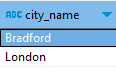
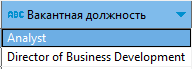

## _База данных для кадрового учета_

## Исходные данные

Данные о сотрудниках представлены в таблице excel
[]

## Отношение состоит из атрибутов: 

- Фамилия и имя сотрудника;
- Контактная информация (почта, адрес проживания);
- Дата рождения;
- Должность;
- Департамент;
- Адрес департамента;
- Период работы;
- Фамилия и имя руководителя;
- Заработная плата.

## Декомпозиция отношения

Для построения логической схемы было принято предположение, что организационная структура компании выглядит следующим образом.
[]

## Задачи

Нормализовать исходную таблицу.Получившиеся отношения должны быть не ниже 3 Нормальной Формы.
В результате должна быть диаграмма из не менее чем 5 нормализованных отношений и 1 таблицы с историчностью, соответствующей требованиям SCD4.
Контролировать целостность данных в таблице с историчными данными необходимо с помощью триггерной функции.

## Схема базы данных

[]

## Краткое описание таблиц

Люди (persons) - таблица, содержит информации о фамилии и имени (surname, name), дате рождения (birthdate), адресе проживания (address_id) и электронной почте (email). Сущность описывает физических лиц осуществляющих / осуществлявших трудовую деятельность в компании.
[]

Структурные подразделения (departments) - таблица, содержит наименования (department_name) и адреса департаментов (address_id). Департаменты образуют иерархию: столбец parent_id - идентификатор руководящего департамента.
[]

Должности (posts) - таблица, содержащая перечень наименований служебных мест (post_name), которые занимают определенное место в штатной структуре организации. Должности формируют иерархию. Идентификатор должности руководителя (parent_id) находится в данной таблице, т.к. при помещении данного атрибута, например, в таблицу сотрудники, можно при удалении сотрудника  утратить также информацию о руководителе должности (если на место удаляемого сотрудника никого не принимают).
[]

Штатное расписание (post_department) - таблица, содержит ссылки на структурные подразделения (department_id), должности (post_id), количество штатных единиц (amount).
Также имеется флаг, является ли должность главой данного департамента (is_supervisor).
[]

Сотрудники (employees)  - люди, которые занимают должности, предусмотренные штатным расписанием (post_department_id), получают заработную плату за свой труд (salary), начиная с какого-то периода времени (date_from).
Сотрудники могут работать по внутреннему совместительству, т.е. занимать несколько должностей.
[]

Города (cities) - таблица содержит список населенных пунктов, в которых находятся / находились подразделения или проживают / проживали  сотрудники.
[]

Адреса (addresses) - таблица содержит список улиц, номеров строений и помещений, в которых находятся / находились подразделения или проживают / проживали  сотрудники.
[]

Исторические данные по сотрудникам (emps_history) - копия сведений, удаляемых из актуальной таблицы employees.
[]

## Функции, которые можно выполнять с помощью данной базы данных (помимо стандартных CRUD-операций)

- Получить иерархию департаментов
[]

- Узнать, в каких городах находятся департаменты
[]

- Узнать, кто руководители департаментов
[]

- Узнать, какова самая большая зарплата в каждом департаменте
[]

- Получить иерархию должностей
[]

- Получить список сотрудников с руководителями
[]

- Узнать, какие должности есть в каждом подразделении, какие заняты, какие свободны
[]

- Узнать, есть ли вакантные должности
[]

- Узнать, сколько подчиненных у руководителя, кто они
[]

- Узнать руководителя подразделения
[]

- Узнать, сколько человек в каждом подразделении, кто они 
[]

- Узнать, какие люди совмещают должности
[]

## Логика работы триггера

Реализовано два триггера:

- before - срабатывает на вставку и изменение в таблицу employees признака post_department_id. Он проверяет имеет ли место превышение количества штатных единиц.

- after  - срабатывает на вставку, изменение и удаление в таблицу employees. Этот триггер удаляет устаревшие записи из таблицы employees и вносит данные в таблицу с историей emps_history. 

## Основной сценарий: сотрудника принимают на свободную ставку
- Вставка новой записи в таблицу employees без удаления имеющихся
- Проверить сколько post_department_id в employees и количество штатных единиц в post_department
- Если количество записей в employees не превышает количество штатных единиц, никакие записи не удаляются

## Альтернативный сценарий: одного сотрудника заменяют другим
- Вставка новой записи в таблицу employees возможно только с одновременным удалением имеющихся и переносом старой записи в таблицу с историей
- Проверить сколько post_department_id в employees и количество штатных единиц в post_department
- Если количество записей в employees равно количеству штатных единиц, но не равно 1, показываем сообщение о необходимости удалить одну из записей или увеличить штат
- Если количество записей в employees равно количеству штатных единиц и не равно 1, удаляем старую запись (переносим ее в историю) и вносим новую

